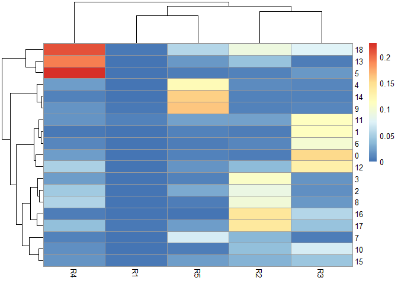
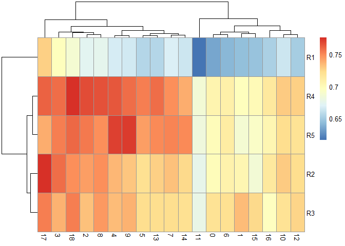
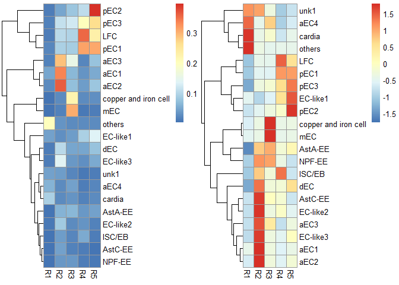
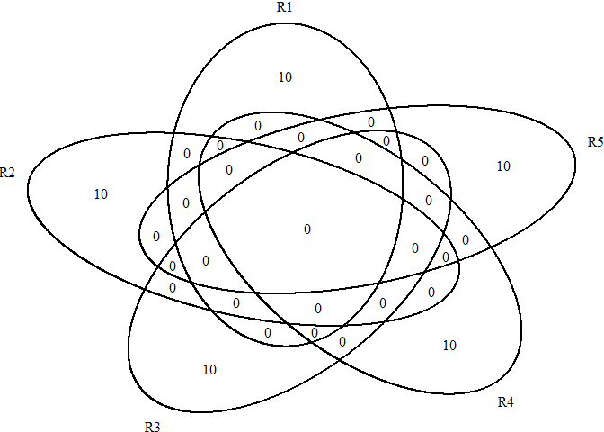
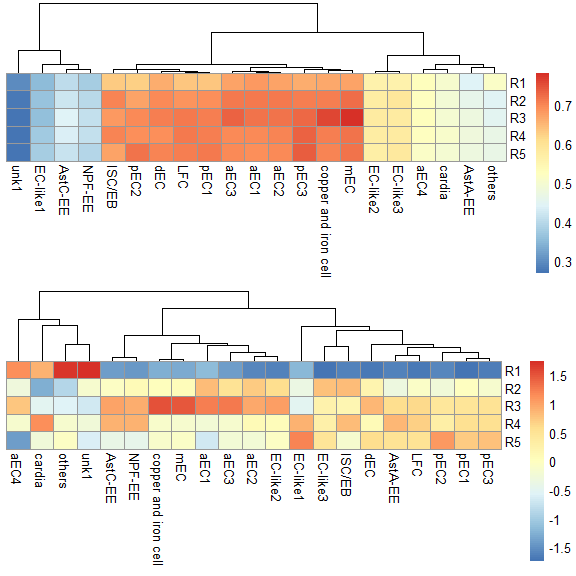

<!-- README.md is generated from README.Rmd. Please edit that file -->

# MyRPackage

<!-- badges: start -->

[](https://lifecycle.r-lib.org/articles/stages.html#stable)
<!-- badges: end -->

R functions used at my work.

## Installation

You can install the development version of MyRPackage from
[GitHub](https://github.com/fentouxungui/MyRPackage) with:

``` r
# install.packages("devtools")
devtools::install_github("fentouxungui/MyRPackage")
```

## Examples

This is a basic example which shows you how to solve a common problem:

``` r
library(Seurat)
#> Attaching SeuratObject
#> Attaching sp
library(gridExtra)
library(MyRPackage)
```

### 1. scRNAseq

#### 1.1 Predict Cluster location from bulk RNA-seq

使用EC的各个区段的RNA-seq值，来对单细胞中的各个EC细胞亚群，进行定位预测。

> 单细胞数据来自文章: Hung R J, Hu Y, Kirchner R, et al. A cell atlas of
> the adult Drosophila midgut\[J\]. Proceedings of the National Academy
> of Sciences, 2020, 117(3): 1514-1523.

> RNA-seq数据来自[Flygut-seq: Cell and region specific gene expression
> of the fly midgut](http://flygutseq.buchonlab.com/)

##### 1.1.1 Preparation

将RNAseq里的基因ID转为symbol，注意，要使用与单细胞数据分析用的GTF文件来生成`FlyGeneMeta`。

``` r
# RNAseq data
data(FlyGeneMeta)
data(RNAseq)
head(RNAseq$EC)
#>                     R1         R2         R3         R4         R5
#> FBgn0000003 0.00000000 0.00000000 0.00000000 0.00000000 0.00000000
#> FBgn0000008 0.99406575 1.96251049 0.31337624 1.90011232 0.52664174
#> FBgn0000014 0.02751965 0.14201820 0.10356404 0.30602071 0.15670007
#> FBgn0000015 0.01164936 0.08265733 0.05089256 0.17023985 0.09432941
#> FBgn0000017 0.01560269 0.04168749 0.03383766 0.05107372 0.04774208
#> FBgn0000018 4.01871689 4.47380060 4.42188673 4.79100658 4.35939753
bulkRNAseq <- scRNAseq_Score_Region_Check(RNAseq$EC, FlyGeneMeta)
#> 395 features from data frame not exist in meta file!
head(bulkRNAseq)
#>                        R1         R2         R3         R4         R5
#> 7SLRNA:CR32864 0.00000000 0.00000000 0.00000000 0.00000000 0.00000000
#> a              0.99406575 1.96251049 0.31337624 1.90011232 0.52664174
#> abd-A          0.02751965 0.14201820 0.10356404 0.30602071 0.15670007
#> Abd-B          0.01164936 0.08265733 0.05089256 0.17023985 0.09432941
#> Abl            0.01560269 0.04168749 0.03383766 0.05107372 0.04774208
#> abo            4.01871689 4.47380060 4.42188673 4.79100658 4.35939753
```

``` r
# scRNAseq data
data(scRNA)
scRNA
#> An object of class Seurat 
#> 16960 features across 2979 samples within 1 assay 
#> Active assay: RNA (16960 features, 4000 variable features)
#>  4 dimensional reductions calculated: pca, harmony, umap, tsne
DimPlot(scRNA, label = TRUE) + NoLegend()
```



##### 1.1.2 Method 1: Region top Genes in binary mode

``` r
score.list <- scRNAseq_Score_Region(scRNA, bulkRNAseq)
#> 2724 features from RNA-seq not exist in scRNAseq!
scRNAseq_Score_Region_evaluate(score.list, cluster_rows = FALSE, cluster_cols = FALSE, 
                               main = "Gini index of each parameter combination (x - Top Genes, y - UMI Cutoff)")
```



``` r
# correlation of each parameter combination
# scRNAseq_Score_Region_evaluate2(score.list)
```

**使用默认参数，即组合有最大Gini index value。**

``` r
p1 <- scRNAseq_Score_Region_plot(score.list, cluster_cols = FALSE, silent = TRUE)
#> Using UMI Cutoff: 20; Genes Used: 10
p2 <- scRNAseq_Score_Region_plot(score.list, cluster_cols = FALSE, scale = "row", silent = TRUE)
#> Using UMI Cutoff: 20; Genes Used: 10
grid.arrange(p1[[4]],p2[[4]],nrow = 1) & NoLegend()
```



    #> NULL

``` r
# show the selected genes
futile.logger::flog.threshold(futile.logger::ERROR, name = "VennDiagramLogger")
#> NULL
scRNAseq_Score_Region_ExtractFeatures(score.list)
#> Using UMI Cutoff: 20; Genes Used: 10
```



    #> NULL
    #>       R1        R2                R3         R4         R5       
    #>  [1,] "CG17738" "Mal-A7"          "Zip42C.2" "Ser8"     "CG17477"
    #>  [2,] "CG3819"  "CG4830"          "CG6277"   "CG11911"  "CG31265"
    #>  [3,] "CG6839"  "Npc2f"           "CG43789"  "CG11912"  "CG17475"
    #>  [4,] "CG43673" "CG8834"          "Vha100-4" "CG17571"  "CG4053" 
    #>  [5,] "CG11854" "CG15617"         "CG6901"   "Jon99Fi"  "CG6337" 
    #>  [6,] "to"      "CG9682"          "CG31446"  "CG10472"  "CG32379"
    #>  [7,] "CG43134" "Peritrophin-15a" "CG31663"  "Jon99Fii" "CG8774" 
    #>  [8,] "Yp3"     "CG30340"         "CG5770"   "CG7953"   "CG31267"
    #>  [9,] "CG15649" "CG34040"         "CG30479"  "Jon66Ci"  "CG43208"
    #> [10,] "Muc68D"  "CG18404"         "CG17930"  "Jon44E"   "CG32284"

**使用自定义参数，即设定UMI Cutoff为100和选取前100个基因。**

``` r
p1 <- scRNAseq_Score_Region_plot(score.list, 100, 100, cluster_cols = FALSE, silent = TRUE)
p2 <- scRNAseq_Score_Region_plot(score.list, 100, 100, cluster_cols = FALSE, scale = "row", silent = TRUE)
grid.arrange(p1[[4]],p2[[4]],nrow = 1) & NoLegend()
```


    #> NULL

``` r
# show the selected genes
# futile.logger::flog.threshold(futile.logger::ERROR, name = "VennDiagramLogger")
# scRNAseq_Score_Region_ExtractFeatures(score.list, 100, 100)
```

**可以看到，使用这两种参数，都可以准确判定EC亚群的定位，并可以给出更准确的定位。**

##### 1.1.3 Method 2: Expression correlation

**使用所有基因**

``` r
score.matrix <- scRNAseq_Score_Region2(scRNA, bulkRNAseq, Method = "spearman")
#> 2724 features from RNA-seq not exist in scRNAseq!
p1 <- pheatmap::pheatmap(score.matrix, cluster_rows = FALSE, silent = TRUE)
p2 <- pheatmap::pheatmap(score.matrix, scale = "column", cluster_rows = FALSE, silent = TRUE)
grid.arrange(p1[[4]],p2[[4]],nrow = 2) & NoLegend()
```



    #> NULL

**使用Top基因**

``` r
score.matrix <- scRNAseq_Score_Region2(scRNA, bulkRNAseq, Method = "spearman", Genes.Selection = "Top")
#> 2724 features from RNA-seq not exist in scRNAseq!
p1 <- pheatmap::pheatmap(score.matrix, cluster_rows = FALSE, silent = TRUE)
p2 <- pheatmap::pheatmap(score.matrix, scale = "column", cluster_rows = FALSE, silent = TRUE)
grid.arrange(p1[[4]],p2[[4]],nrow = 2) & NoLegend()
```


    #> NULL

**同样使用基于correlation的两种计算方式，也都可以准确判定EC亚群的定位，并可以给出更准确的定位。**

感兴趣的童鞋，可以测试一下用EE的Regional RNA-seq RPKM
value预测EE细胞类群的定位！

##### 1.1.4 compare results from two methods

**计算不同预测方案的cluster \* region 矩阵之间的相关性。**

``` r
head(scRNAseq_Score_Compare(score.list,score.matrix),20)
#>    UMI-20-Genes-40   UMI-200-Genes-40  UMI-2000-Genes-40  UMI-1500-Genes-50 
#>          0.5777317          0.5777317          0.5777317          0.5716270 
#>    UMI-10-Genes-40   UMI-100-Genes-40  UMI-1000-Genes-40    UMI-10-Genes-50 
#>          0.5565741          0.5565741          0.5565741          0.5516927 
#>   UMI-100-Genes-50  UMI-1000-Genes-50    UMI-20-Genes-20   UMI-200-Genes-20 
#>          0.5516927          0.5516927          0.5444626          0.5444626 
#>  UMI-2000-Genes-20   UMI-10-Genes-100  UMI-100-Genes-100 UMI-1000-Genes-100 
#>          0.5444626          0.5440390          0.5440390          0.5440390 
#>  UMI-1500-Genes-40 UMI-1500-Genes-100    UMI-10-Genes-30   UMI-100-Genes-30 
#>          0.5420852          0.5397056          0.5365468          0.5365468
```

**更推荐的方案：从RNAseq的fastq文件入手，计算各个区域的高表达基因，做成基因集合，然后对每一个单细胞进行region定位的偏好性打分（AddModuleScore？），进而也能推断群水平的region偏好性。**

## Session Info

``` r
sessionInfo()
#> R version 4.2.1 (2022-06-23 ucrt)
#> Platform: x86_64-w64-mingw32/x64 (64-bit)
#> Running under: Windows 10 x64 (build 19043)
#> 
#> Matrix products: default
#> 
#> locale:
#> [1] LC_COLLATE=Chinese (Simplified)_China.utf8 
#> [2] LC_CTYPE=Chinese (Simplified)_China.utf8   
#> [3] LC_MONETARY=Chinese (Simplified)_China.utf8
#> [4] LC_NUMERIC=C                               
#> [5] LC_TIME=Chinese (Simplified)_China.utf8    
#> 
#> attached base packages:
#> [1] stats     graphics  grDevices utils     datasets  methods   base     
#> 
#> other attached packages:
#> [1] MyRPackage_0.0.0.9000 gridExtra_2.3         sp_1.5-0             
#> [4] SeuratObject_4.1.0    Seurat_4.1.1         
#> 
#> loaded via a namespace (and not attached):
#>   [1] Rtsne_0.16            colorspace_2.0-3      deldir_1.0-6         
#>   [4] ellipsis_0.3.2        ggridges_0.5.3        futile.logger_1.4.3  
#>   [7] rstudioapi_0.13       spatstat.data_2.2-0   farver_2.1.0         
#>  [10] leiden_0.4.2          listenv_0.8.0         ggrepel_0.9.1        
#>  [13] fansi_1.0.3           codetools_0.2-18      splines_4.2.1        
#>  [16] knitr_1.39            polyclip_1.10-0       jsonlite_1.8.0       
#>  [19] ica_1.0-2             cluster_2.1.3         png_0.1-7            
#>  [22] rgeos_0.5-9           pheatmap_1.0.12       uwot_0.1.11          
#>  [25] ineq_0.2-13           shiny_1.7.1           sctransform_0.3.3    
#>  [28] spatstat.sparse_2.1-1 compiler_4.2.1        httr_1.4.3           
#>  [31] assertthat_0.2.1      Matrix_1.4-1          fastmap_1.1.0        
#>  [34] lazyeval_0.2.2        cli_3.3.0             formatR_1.12         
#>  [37] later_1.3.0           htmltools_0.5.2       tools_4.2.1          
#>  [40] igraph_1.3.2          gtable_0.3.0          glue_1.6.2           
#>  [43] RANN_2.6.1            reshape2_1.4.4        dplyr_1.0.9          
#>  [46] Rcpp_1.0.8.3          scattermore_0.8       vctrs_0.4.1          
#>  [49] nlme_3.1-157          progressr_0.10.1      lmtest_0.9-40        
#>  [52] spatstat.random_2.2-0 xfun_0.31             stringr_1.4.0        
#>  [55] globals_0.15.0        mime_0.12             miniUI_0.1.1.1       
#>  [58] lifecycle_1.0.1       irlba_2.3.5           goftest_1.2-3        
#>  [61] future_1.26.1         MASS_7.3-57           zoo_1.8-10           
#>  [64] scales_1.2.0          spatstat.core_2.4-4   promises_1.2.0.1     
#>  [67] spatstat.utils_2.3-1  parallel_4.2.1        lambda.r_1.2.4       
#>  [70] RColorBrewer_1.1-3    yaml_2.3.5            reticulate_1.25      
#>  [73] pbapply_1.5-0         ggplot2_3.3.6         rpart_4.1.16         
#>  [76] stringi_1.7.6         highr_0.9             rlang_1.0.3          
#>  [79] pkgconfig_2.0.3       matrixStats_0.62.0    evaluate_0.15        
#>  [82] lattice_0.20-45       ROCR_1.0-11           purrr_0.3.4          
#>  [85] tensor_1.5            labeling_0.4.2        patchwork_1.1.1      
#>  [88] htmlwidgets_1.5.4     cowplot_1.1.1         tidyselect_1.1.2     
#>  [91] parallelly_1.32.0     RcppAnnoy_0.0.19      plyr_1.8.7           
#>  [94] magrittr_2.0.3        R6_2.5.1              generics_0.1.2       
#>  [97] DBI_1.1.3             mgcv_1.8-40           pillar_1.7.0         
#> [100] fitdistrplus_1.1-8    survival_3.3-1        abind_1.4-5          
#> [103] tibble_3.1.7          future.apply_1.9.0    crayon_1.5.1         
#> [106] futile.options_1.0.1  KernSmooth_2.23-20    utf8_1.2.2           
#> [109] spatstat.geom_2.4-0   plotly_4.10.0         rmarkdown_2.14       
#> [112] grid_4.2.1            data.table_1.14.2     digest_0.6.29        
#> [115] VennDiagram_1.7.3     xtable_1.8-4          tidyr_1.2.0          
#> [118] httpuv_1.6.5          munsell_0.5.0         viridisLite_0.4.0
```
