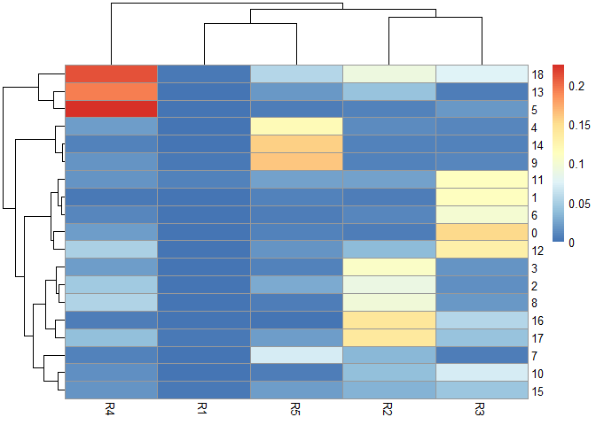
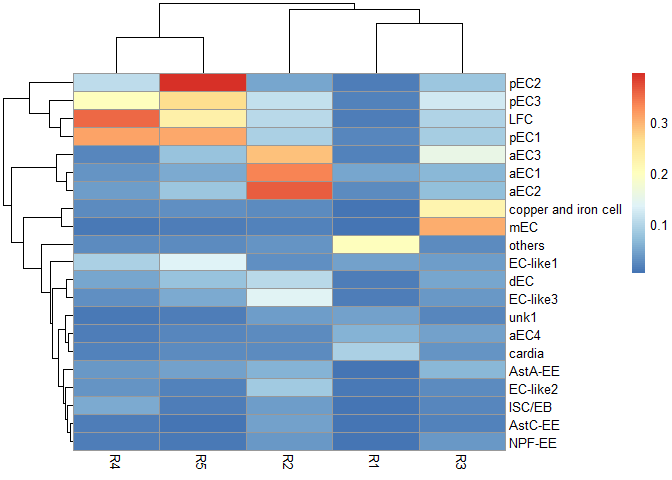
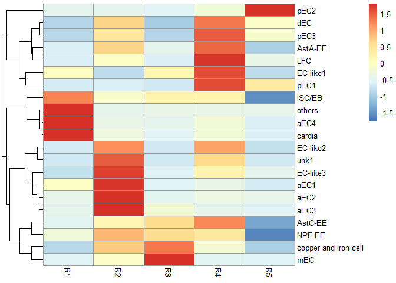

<!-- README.md is generated from README.Rmd. Please edit that file -->

# MyRPackage

<!-- badges: start -->
<!-- badges: end -->

R functions used at my work.

## Installation

You can install the development version of MyRPackage from
[GitHub](https://github.com/) with:

``` r
# install.packages("devtools")
devtools::install_github("fentouxungui/MyRPackage")
```

## Example

This is a basic example which shows you how to solve a common problem:

``` r
library(MyRPackage)
```

### scRNAseq

#### Predict Cluster location from bulk RNA-seq

##### Preparation

将RNAseq里的基因ID转为symbol，注意，要使用与单细胞数据分析用的GTF文件来生成`FlyGeneMeta`。

``` r
data(FlyGeneMeta)
data(ISC)
head(ISC)
#>                R1    R2    R3    R4    R5
#> FBgn0000003 0.069     0     0     0     0
#> FBgn0000008 0.525 1.392 0.845 1.056 0.946
#> FBgn0000014 0.007 0.002     0 0.005 0.001
#> FBgn0000015  0.05 0.048     0 0.008  0.03
#> FBgn0000017 0.053 0.045 0.067 0.024 0.039
#> FBgn0000018 1.062 3.179 2.493 3.157 3.051
head(scRNAseq_Score_Region_Check(ISC, FlyGeneMeta))
#> 0 features from data frame not exist in meta file!
#>                   R1    R2    R3    R4    R5
#> 7SLRNA:CR32864 0.069     0     0     0     0
#> a              0.525 1.392 0.845 1.056 0.946
#> abd-A          0.007 0.002     0 0.005 0.001
#> Abd-B           0.05 0.048     0 0.008  0.03
#> Abl            0.053 0.045 0.067 0.024 0.039
#> abo            1.062 3.179 2.493 3.157 3.051
```

##### Method 1: Region top Genes in binary mode

``` r
data(scRNA)
data(bulkRNA)
score.list <- scRNAseq_Score_Region(scRNA, bulkRNA)
scRNAseq_Score_Region_evaluate(score.list)
```



``` r
# correlation of each parameter combination
# scRNAseq_Score_Region_evaluate2(score.list)
```

``` r
scRNAseq_Score_Region_plot(score.list)
#> Using UMI Cutoff: 20; Genes Used: 10
```


``` r
scRNAseq_Score_Region_plot(score.list, 100, 100)
```



##### Method 2: Expression correlation

``` r
score.matrix <- scRNAseq_Score_Region2(scRNA, bulkRNA, Method = "spearman")
pheatmap::pheatmap(score.matrix)
```


``` r
score.matrix <- scRNAseq_Score_Region2(scRNA, bulkRNA, Method = "spearman", Genes.Selection = "Top")
pheatmap::pheatmap(score.matrix)
```



##### compare results from two methods

``` r
head(scRNAseq_Score_Compare(score.list,score.matrix),20)
#>   UMI-10-Genes-400  UMI-100-Genes-400 UMI-1000-Genes-400 UMI-1500-Genes-300 
#>          0.7387318          0.7387318          0.7387318          0.7123555 
#>   UMI-10-Genes-300  UMI-100-Genes-300 UMI-1000-Genes-300   UMI-10-Genes-500 
#>          0.7095885          0.7095885          0.7095885          0.7006579 
#>  UMI-100-Genes-500 UMI-1000-Genes-500    UMI-50-Genes-50   UMI-500-Genes-50 
#>          0.7006579          0.7006579          0.6971685          0.6971685 
#> UMI-1500-Genes-200    UMI-50-Genes-30   UMI-500-Genes-30   UMI-10-Genes-200 
#>          0.6921613          0.6844487          0.6844487          0.6827991 
#>  UMI-100-Genes-200 UMI-1000-Genes-200   UMI-30-Genes-200  UMI-200-Genes-300 
#>          0.6827991          0.6827991          0.6770857          0.6748740
```
