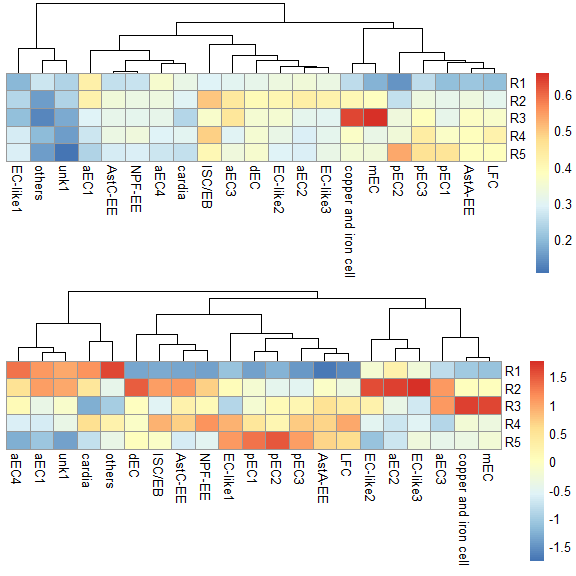

<!-- README.md is generated from README.Rmd. Please edit that file -->

# MyRPackage

<!-- badges: start -->

[](https://lifecycle.r-lib.org/articles/stages.html#stable)
<!-- badges: end -->

R functions used at my work.

## Installation

You can install the development version of MyRPackage from
[GitHub](https://github.com/fentouxungui/MyRPackage) with:

``` r
# install.packages("devtools")
devtools::install_github("fentouxungui/MyRPackage")
```

## Examples

This is a basic example which shows you how to solve a common problem:

``` r
library(Seurat)
#> Attaching SeuratObject
#> Attaching sp
library(gridExtra)
library(MyRPackage)
```

### 1. scRNAseq

#### 1.1 Predict Cluster location from bulk RNA-seq

使用EC的各个区段的RNA-seq值，来对单细胞中的各个EC细胞亚群，进行定位预测。

> 单细胞数据来自文章: Hung R J, Hu Y, Kirchner R, et al. A cell atlas of
> the adult Drosophila midgut\[J\]. Proceedings of the National Academy
> of Sciences, 2020, 117(3): 1514-1523.

> RNA-seq数据来自[Flygut-seq: Cell and region specific gene expression
> of the fly midgut](http://flygutseq.buchonlab.com/)

##### 1.1.1 Preparation

将RNAseq里的基因ID转为symbol，注意，要使用与单细胞数据分析用的GTF文件来生成`FlyGeneMeta`。

``` r
# RNAseq data
data(FlyGeneMeta)
data(RNAseq)
head(RNAseq$EC)
#>                     R1         R2         R3         R4         R5
#> FBgn0000003 0.00000000 0.00000000 0.00000000 0.00000000 0.00000000
#> FBgn0000008 0.99406575 1.96251049 0.31337624 1.90011232 0.52664174
#> FBgn0000014 0.02751965 0.14201820 0.10356404 0.30602071 0.15670007
#> FBgn0000015 0.01164936 0.08265733 0.05089256 0.17023985 0.09432941
#> FBgn0000017 0.01560269 0.04168749 0.03383766 0.05107372 0.04774208
#> FBgn0000018 4.01871689 4.47380060 4.42188673 4.79100658 4.35939753
bulkRNAseq <- scRNAseq_Score_Region_Check(RNAseq$EC, FlyGeneMeta)
#> 395 features from data frame not exist in meta file!
head(bulkRNAseq)
#>                        R1         R2         R3         R4         R5
#> 7SLRNA:CR32864 0.00000000 0.00000000 0.00000000 0.00000000 0.00000000
#> a              0.99406575 1.96251049 0.31337624 1.90011232 0.52664174
#> abd-A          0.02751965 0.14201820 0.10356404 0.30602071 0.15670007
#> Abd-B          0.01164936 0.08265733 0.05089256 0.17023985 0.09432941
#> Abl            0.01560269 0.04168749 0.03383766 0.05107372 0.04774208
#> abo            4.01871689 4.47380060 4.42188673 4.79100658 4.35939753
```

``` r
# scRNAseq data
data(scRNA)
scRNA
#> An object of class Seurat 
#> 16960 features across 2979 samples within 1 assay 
#> Active assay: RNA (16960 features, 4000 variable features)
#>  4 dimensional reductions calculated: pca, harmony, umap, tsne
DimPlot(scRNA, label = TRUE) + NoLegend()
```


##### 1.1.2 Method 1: Region top Genes in binary mode

``` r
score.list <- scRNAseq_Score_Region(scRNA, bulkRNAseq)
#> 2724 features from RNA-seq not exist in scRNAseq!
scRNAseq_Score_Region_evaluate(score.list, cluster_rows = FALSE, cluster_cols = FALSE, 
                               main = "Gini index of each parameter combination (x - Top Genes, y - UMI Cutoff)")
```


``` r
# correlation of each parameter combination
# scRNAseq_Score_Region_evaluate2(score.list)
```

**使用默认参数，即组合有最大Gini index value。**

``` r
p1 <- scRNAseq_Score_Region_plot(score.list, cluster_cols = FALSE, silent = TRUE)
#> Using UMI Cutoff: 20; Genes Used: 10
p2 <- scRNAseq_Score_Region_plot(score.list, cluster_cols = FALSE, scale = "row", silent = TRUE)
#> Using UMI Cutoff: 20; Genes Used: 10
grid.arrange(p1[[4]],p2[[4]],nrow = 1) & NoLegend()
```


    #> NULL

**使用自定义参数，即设定UMI Cutoff为100和选取前100个基因。**

``` r
p1 <- scRNAseq_Score_Region_plot(score.list, 100, 100, cluster_cols = FALSE, silent = TRUE)
p2 <- scRNAseq_Score_Region_plot(score.list, 100, 100, cluster_cols = FALSE, scale = "row", silent = TRUE)
grid.arrange(p1[[4]],p2[[4]],nrow = 1) & NoLegend()
```


    #> NULL

**可以看到，使用这两种参数，都可以准确判定EC亚群的定位，并可以给出更准确的定位。**

##### 1.1.3 Method 2: Expression correlation

**使用所有基因**

``` r
score.matrix <- scRNAseq_Score_Region2(scRNA, bulkRNAseq, Method = "spearman")
#> 2724 features from RNA-seq not exist in scRNAseq!
p1 <- pheatmap::pheatmap(score.matrix, cluster_rows = FALSE, silent = TRUE)
p2 <- pheatmap::pheatmap(score.matrix, scale = "column", cluster_rows = FALSE, silent = TRUE)
grid.arrange(p1[[4]],p2[[4]],nrow = 2) & NoLegend()
```


    #> NULL

**使用Top基因**

``` r
score.matrix <- scRNAseq_Score_Region2(scRNA, bulkRNAseq, Method = "spearman", Genes.Selection = "Top")
#> 2724 features from RNA-seq not exist in scRNAseq!
p1 <- pheatmap::pheatmap(score.matrix, cluster_rows = FALSE, silent = TRUE)
p2 <- pheatmap::pheatmap(score.matrix, scale = "column", cluster_rows = FALSE, silent = TRUE)
grid.arrange(p1[[4]],p2[[4]],nrow = 2) & NoLegend()
```



    #> NULL

**同样使用基于correlation的两种计算方式，也都可以准确判定EC亚群的定位，并可以给出更准确的定位。**

感兴趣的童鞋，可以测试一下用EE的Regional RNA-seq RPKM
value预测EE细胞类群的定位！

##### 1.1.4 compare results from two methods

**计算不同预测方案的cluster \* region 矩阵之间的相关性。**

``` r
head(scRNAseq_Score_Compare(score.list,score.matrix),20)
#>    UMI-20-Genes-40   UMI-200-Genes-40  UMI-2000-Genes-40  UMI-1500-Genes-50 
#>          0.5777317          0.5777317          0.5777317          0.5716270 
#>    UMI-10-Genes-40   UMI-100-Genes-40  UMI-1000-Genes-40    UMI-10-Genes-50 
#>          0.5565741          0.5565741          0.5565741          0.5516927 
#>   UMI-100-Genes-50  UMI-1000-Genes-50    UMI-20-Genes-20   UMI-200-Genes-20 
#>          0.5516927          0.5516927          0.5444626          0.5444626 
#>  UMI-2000-Genes-20   UMI-10-Genes-100  UMI-100-Genes-100 UMI-1000-Genes-100 
#>          0.5444626          0.5440390          0.5440390          0.5440390 
#>  UMI-1500-Genes-40 UMI-1500-Genes-100    UMI-10-Genes-30   UMI-100-Genes-30 
#>          0.5420852          0.5397056          0.5365468          0.5365468
```

**更推荐的方案：从RNAseq的fastq文件入手，计算各个区域的高表达基因，做成基因集合，然后对每一个单细胞进行region定位的偏好性打分（AddModuleScore？），进而也能推断群水平的region偏好性。**
