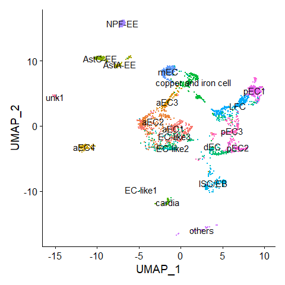

<!-- README.md is generated from README.Rmd. Please edit that file -->

# MyRPackage

<!-- badges: start -->
<!-- badges: end -->

R functions used at my work.

## Installation

You can install the development version of MyRPackage from
[GitHub](https://github.com/) with:

``` r
# install.packages("devtools")
devtools::install_github("fentouxungui/MyRPackage")
```

## Example

This is a basic example which shows you how to solve a common problem:

``` r
library(MyRPackage)
```

### scRNAseq

#### Predict Cluster location from bulk RNA-seq

##### Preparation

将RNAseq里的基因ID转为symbol，注意，要使用与单细胞数据分析用的GTF文件来生成`FlyGeneMeta`。

``` r
# RNAseq data
data(FlyGeneMeta)
data(RNAseq)
head(RNAseq$EE)
#>                      R1         R2         R3          R4         R5
#> FBgn0000003 0.000000000 0.00000000 0.00000000 0.000000000 0.00000000
#> FBgn0000008 0.078084992 0.23652162 0.12130506 0.675924534 0.99934510
#> FBgn0000014 0.003711065 0.01257281 0.01438128 0.007068035 0.01888023
#> FBgn0000015 0.142135265 0.36725571 0.07907955 0.301346516 0.68504674
#> FBgn0000017 0.025049912 0.04514559 0.05932194 0.076590622 0.12278949
#> FBgn0000018 2.082508122 3.41759888 3.41194403 5.292428057 5.33207506
bulkRNAseq <- scRNAseq_Score_Region_Check(RNAseq$EE, FlyGeneMeta)
#> 395 features from data frame not exist in meta file!
head(bulkRNAseq)
#>                         R1         R2         R3          R4         R5
#> 7SLRNA:CR32864 0.000000000 0.00000000 0.00000000 0.000000000 0.00000000
#> a              0.078084992 0.23652162 0.12130506 0.675924534 0.99934510
#> abd-A          0.003711065 0.01257281 0.01438128 0.007068035 0.01888023
#> Abd-B          0.142135265 0.36725571 0.07907955 0.301346516 0.68504674
#> Abl            0.025049912 0.04514559 0.05932194 0.076590622 0.12278949
#> abo            2.082508122 3.41759888 3.41194403 5.292428057 5.33207506
# scRNAseq data
data(scRNA)
scRNA
#> An object of class Seurat 
#> 17559 features across 1860 samples within 1 assay 
#> Active assay: RNA (17559 features, 4000 variable features)
#>  4 dimensional reductions calculated: pca, harmony, umap, tsne
```

##### Method 1: Region top Genes in binary mode

``` r
score.list <- scRNAseq_Score_Region(scRNA, bulkRNAseq)
#> 0 features from RNA-seq not exist in scRNAseq!
scRNAseq_Score_Region_evaluate(score.list)
```


``` r
# correlation of each parameter combination
# scRNAseq_Score_Region_evaluate2(score.list)
```

``` r
scRNAseq_Score_Region_plot(score.list)
#> Using UMI Cutoff: 20; Genes Used: 10
```



``` r
scRNAseq_Score_Region_plot(score.list, 100, 100)
```


##### Method 2: Expression correlation

``` r
score.matrix <- scRNAseq_Score_Region2(scRNA, bulkRNAseq, Method = "spearman")
#> 0 features from RNA-seq not exist in scRNAseq!
pheatmap::pheatmap(score.matrix)
```


``` r
score.matrix <- scRNAseq_Score_Region2(scRNA, bulkRNAseq, Method = "spearman", Genes.Selection = "Top")
#> 0 features from RNA-seq not exist in scRNAseq!
pheatmap::pheatmap(score.matrix)
```


##### compare results from two methods

``` r
head(scRNAseq_Score_Compare(score.list,score.matrix),20)
#>   UMI-10-Genes-400  UMI-100-Genes-400 UMI-1000-Genes-400 UMI-1500-Genes-300 
#>          0.7387318          0.7387318          0.7387318          0.7123555 
#>   UMI-10-Genes-300  UMI-100-Genes-300 UMI-1000-Genes-300   UMI-10-Genes-500 
#>          0.7095885          0.7095885          0.7095885          0.7006579 
#>  UMI-100-Genes-500 UMI-1000-Genes-500    UMI-50-Genes-50   UMI-500-Genes-50 
#>          0.7006579          0.7006579          0.6971685          0.6971685 
#> UMI-1500-Genes-200    UMI-50-Genes-30   UMI-500-Genes-30   UMI-10-Genes-200 
#>          0.6921613          0.6844487          0.6844487          0.6827991 
#>  UMI-100-Genes-200 UMI-1000-Genes-200   UMI-30-Genes-200  UMI-200-Genes-300 
#>          0.6827991          0.6827991          0.6770857          0.6748740
```
